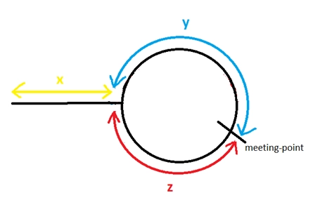

# Linked Lists

## Runtime analysis

1. Access: $$O(n)$$
2. Search: $$O(n)$$
3. Insert: $$O(1)$$ (assuming you traverse to the insertion position or insert at head)
4. Remove: $$O(1)$$ (assuming traversed to node removed)

## Corner cases

1. Empty linked list
2. Single node
3. Two nodes
4. Linked lists with cycles (must clarify)

## Techniques

### Sentinel/dummy nodes

Adding a dummy node to the front and/or end of the linked list is quite a powerful technique

* Helps resolve edge cases for operations performed at the head or tail
* Must be removed at the end of the operation
* Used when creating a doubly linked list to simplify implementation (see [#doubly-linked-list](./#doubly-linked-list "mention") for more information)

### Two pointers

This is somewhat similar to the two pointers in [arrays](../arrays/ "mention") but in the case of linked lists, the two pointers are often used to perform operations on different parts of the linked list.

* Getting kth from last node
  * Delay a second pointer by k and once seeking pointer reaches end, second pointer is the answer
* Detecting cycles
  * Two pointer with fast and slow pointers
* Getting the middle node
  * Fast and slow pointers where once fast is at the end, slow is in the middle

### Using additional linked lists

Rather than trying to operate solely on the given linked list, create a new linked list and copy nodes over

* Increases space usage but makes things less difficulty

### Linked list modifications

* Truncate list by setting `next` to `null`
* Swapping values (either by swapping reference or values)
* Combining two lists by attaching head of second list to tail of first list

### Reversing linked lists

Common problem and good to just recall how the algorithm is implemented

```python
prev, cur = None, head
while cur:
    next_node = cur.next
    prev = cur
    cur.next = prev
    cur = next_node
return prev
```

### Floyd’s cycle detection

Very useful algorithm to know as there are several ways to apply it:

1. Determine the center of a linked list
2. Determine if a cycle exists in a linked list
3. Find the start of the cycle in the linked list

* Fast and slow pointer to detect cycles when the pointers converge with one another

<figure><figcaption></figcaption></figure>

Finding the start of the cycle:

* Once cycle detected, we reset slow to be at the head again and move both pointers by 1 node until they converge again, that’s the starting of the loop
* The distance for the fast pointer to reach back to the start of the cycle is the same distance required for the slow pointer to reach the start of the cycle (so when they converge, that’s when the cycle starts)

$$
\text{fast}=x+y+z+y=x+2y+z\\ \text{slow}=x+y\\ \text{given that fast = 2 * slow}\\ x+2y+z = 2(x+y)\\ x=z
$$
