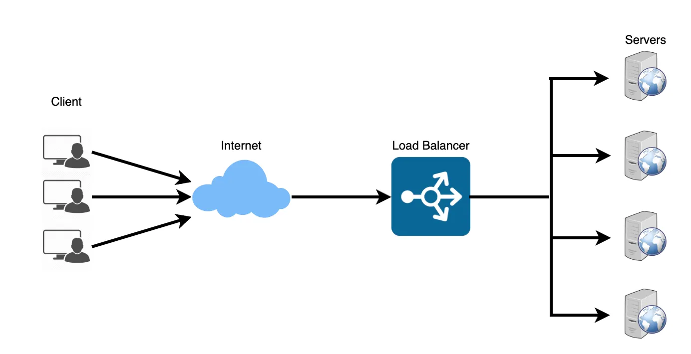
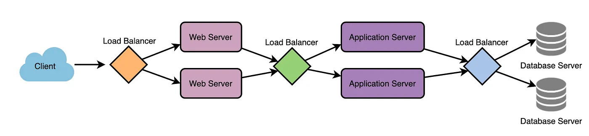
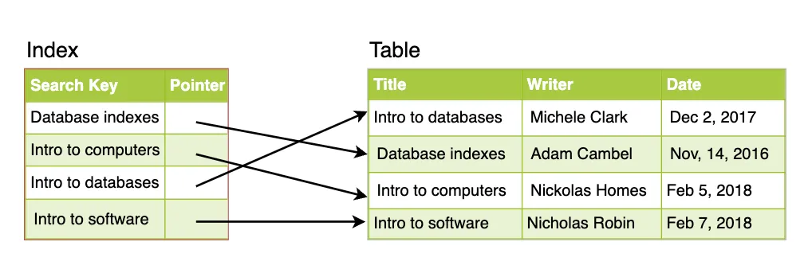
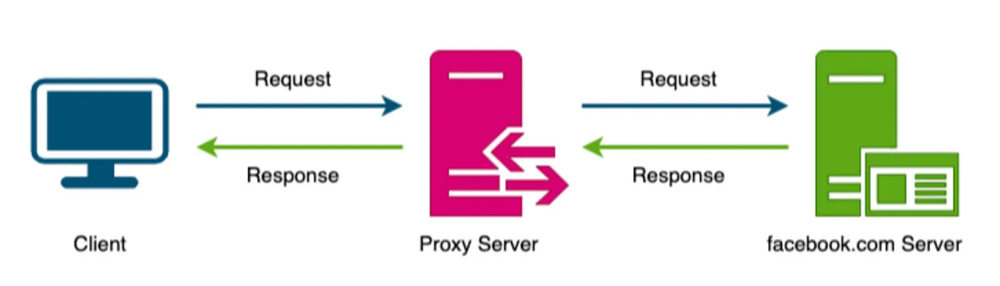
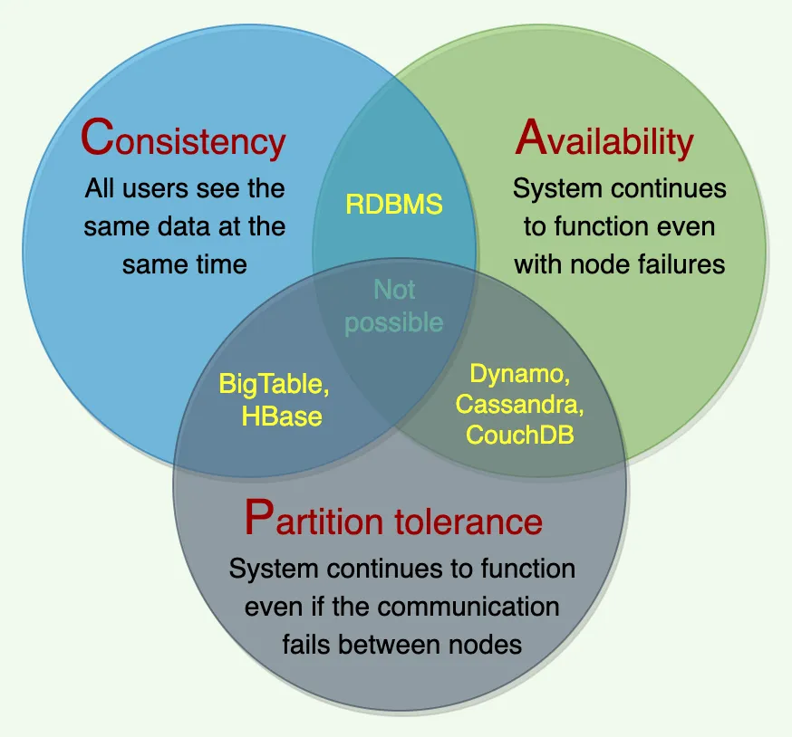
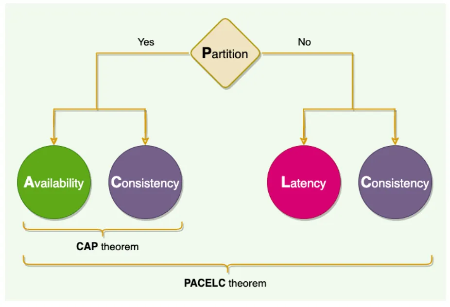

# System Design


There is no better substitute to getting better at design systems than building projects that use these techniques, however, if you are short on time, I have tried compiling the key ideas of system design.\
\
The structure and some of the components have been inspired by this Medium article about the [glossary of system design basics](https://medium.com/@wakefulinsomnia/glossary-of-system-design-basics-longread-69fef72c4079) and I have updated it to suit my needs when revising. Some of the diagrams have been used from that article as well


## Characteristics of Distributed Systems

### Scalability


Ability of a system, process, or network to grow and cope with increasing demand


* Horizontal scaling: scale by adding more servers (Cassandra/MongoDB)
* Vertical scaling: scale by adding more power to existing server (MySQL)
  * Involves downtime of the current server

### Reliability


Probability a system will fail in a given period


* Focus on redundancy of both software and data components
* Availability over time
* Reliability and performance are exclusive
  * High reliability but poor performance and high performance but poor reliability are both possibilities

### Availability


Time a system remains operational to perform its required function


* Includes maintainability, repair time, spares availability, etc.
* Reliable → Available but converse is not true
* Remaining accessible even if one or more nodes is down

### Efficiency


Measured using **latency** and **throughput**


* Latency: delay to obtain the first item (time spent waiting to get first item)
* Throughput: number of items delivered in a given time unit (how many items can be sent in a time period)

### Serviceability/Manageability


Simplicity/speed with which a system can be repaired or maintained


* Ease of diagnosing and understanding problems, ease of making updates/modifications, how simple the system is to operate

## Load Balancing


Spreads traffic across a cluster of servers to improve responsiveness and availability of applications. Keeps track of status of all resources while distributing requests


<figure><figcaption></figcaption></figure>

* Reduces individual server load and avoids single point of failure
* Added:
  * Between user and web server
  * Between web server and internal platform layer like application/cache servers
  * Between internal platform layer and database

<figure><figcaption></figcaption></figure>

* Health check: periodically attempt to connect to backend server, if failed, removes server from pool

### Benefits

* Faster, uninterrupted service
* Service providers experience less downtime and higher throughput
* Easier for system administrators to handle incoming requests while decreasing wait time for others
* Smart load balancers can provide predictive analytics, detecting traffic bottlenecks before they happen
* Fewer failed or stressed components

### Algorithms

* Least connection method: server with fewest active connections; useful for large number of persistent client connections
* Least response time method: server with fewest active connections and lowest average response time
* Least bandwidth method: server that is currently serving the least amount of traffic measured in Mbps
* Round robin method: cycles through list of servers and sends each new request to the next server; useful when servers are of equal specification and not many persistent connections
* Weighted round robin method: servers with different processing capabilities; each server has a weight and higher weighted servers receive new connections first
* IP hash: hash of IP address of client is calculated to redirect request to server
* Redundancy: second load balancer can connect to primary to form cluster; each perform health checks on each other, if main is down, secondary takes over

## Caching


Make better use of existing resources and achieving previously unattainable requirements


* Take advantage of locality of reference principle: recently requested data is likely to be requested again
* Application server cache: caching database resources or user requested data; can be distributed to global/distributed cache
* Content Delivery Network (CDN): caching for blobs/static media
  * Push CDN: changes from server uploaded directly to CDN; good for low traffic systems
  * Pull CDN: new content grabbed from the server when the first user requests the content from the site; slower requests due to cache miss; good for high traffic website

### Cache invalidation

* Write-through: write to both database and cache; high reliability, high latency for writes
  * Achieves data consistency
  * Introduce delay when writing
* Write-around: data written directly to database; less write operations to cache but cache miss needed to cache record
* Write-back: write to cache first and periodically write to database; low latency and high throughput for write intensive, risky for data loss; async write-through
  * Better performance

### Cache eviction policies

* FIFO: first block accessed first
* LIFO: last block accessed
* LRU: least recently used
* MRU: most recently used
* LFU: items with least use discarded first
* Random Replacement: randomly selected

## Data Partitioning


Breaking up a big database into many small parts


* Improves manageability, performance, availability, and load balancing
* Grow horizontally instead of vertically

### Partitioning methods

* Horizontal: range-based partitioning (store rows with key in range to different tables); key must be balanced; [#sharding](./#sharding "mention")
* Vertical: divide data into separate servers; further growth can force each component to partition more finely; [#partitioning](./#partitioning "mention")
* Dictionary-based: lookup service that maps each key to the database server with specific partitioning algorithm; easy to add new servers/change partitioning scheme

### Partitioning criteria

* Key/Hash-based partitioning: hash a key attribute to get partition number; fixes total number of servers since more servers requires hash function to change, involving redistribution of data and downtime; resolve using consistent hashing
* List partitioning: each partition assigned list of values and assign records to partition containing key
* Round-robin partitioning: given `n` partitions, `i` row assigned to partition `i % n`
* Composite partitioning: combining the above partitioning; consistent hashing combines hash and list partitioning to reduce key-space to size that can be listed

### Problems with data partitioning

* Joins and denormalization: not feasible to perform joins that span database partitions and not efficient; workaround to denormalize database so queries can be performed from single table; introduces risk of data inconsistency
* Referential integrity: enforcing integrity constraints like foreign key is difficult, most RDBMS does not support cross server foreign key; requires enforcement on application layer & periodic jobs to clean dangling references
* Rebalancing: non-uniform data distribution and high load on partition requires more database partitions or rebalancing of existing partitions, requiring movement of data to new locations; use dictionary-based partitioning to make rebalancing easier but system more complex and single point of failure (lookup table)

## Indexing


Makes searching through a table faster by using one or more columns of the database table, providing the basis for both rapid random lookups and efficient access of ordered records


* Speed up data retrieval by introducing more keys but can reduce data insertion/update/delete time
* Not worth using if write-heavy

<figure><figcaption></figcaption></figure>

## Proxies


Intermediate piece of software/hardware that sits between client and server, facilitating requests for resources from other servers on behalf of the client, anonymizing the client (forward proxy) or anonymizing the server (reverse proxy)


<figure><figcaption></figcaption></figure>

### Forward proxy

Cache data, filter requests, log requests, transform requests (add/remove headers, encrypt/decrypt, compressing resource)

* Optimize request traffic by combining same data access requests into one request and return the result to the user (collapsed forwarding)

### Reverse proxy

Retrieve resources from one or more servers on behalf of a client, anonymizing the server

* Similar role to forward proxy

<figure><figcaption></figcaption></figure>

## Redundancy & Replication


Redundancy is the duplication of critical components or functions of a system with the intention of increasing the reliability of the system, usually in the form of a backup or fail-safe, or to improve actual system performance


* Removes single points of failure and provides backup in case of crisis
* Focus on components/servers


Replication is the sharing of information to ensure consistency between redundant resources (software/hardware) to improve reliability, fault-tolerance, or accessibility


* Focus on the data
* Primary-replica relationship between original and copies
  * Primary gets all updates, ripple through to replica servers
  * Replicas outputs a message stating it has received the update and allow subsequent updates

## SQL vs NoSQL

* Relational database: structured with predefined schemas like phone books that store phone numbers and addresses
* Non-relational database: unstructured, distributed, and have dynamic schema

### SQL

* Relational database
* Stored in rows and columns
* Row contains all information about entity
* Column contains separate data points

### NoSQL

* Key-value stores: data stored as key-value pairs; e.g. Redis, Voldemort, Dynamo
* Document databases: data stored as documents and grouped together in collections with each document having completely different structure; e.g. CouchDB and MongoDB
* Wide-Column database: column families act as containers for rows, each row does not have the same number of columns; columns not known up front; useful for analyzing large datasets; e.g. Cassandra and HBase
* Graph database: store data whose relations are best represented as a graph; data saved in graph structures with nodes as entities containing properties and lines as edges between entities; e.g. Neo4j and InfiniteGraph

### Key differences

| Property           | SQL                                                                     | NoSQL                                                                                  |
| ------------------ | ----------------------------------------------------------------------- | -------------------------------------------------------------------------------------- |
| Storage            | Data in tables                                                          | Different data storage models                                                          |
| Schema             | Fixed schema, any alterations alter all rows                            | Dynamic schemas without uniformity needed                                              |
| Querying           | Uses SQL to define and manipulate                                       | Uses UnQL (Unstructured Query Language) and query focused on a collection of documents |
| Scalability        | Traditionally built to scale vertically                                 | Horizontally scalable with ease to distribute data across servers automatically        |
| Reliability (ACID) | ACID compliant, reliable and safe guarantee for performing transactions | Sacrifice ACID for performance and scalability                                         |

### ACID

* Atomicity: all transactions must succeed or fail completely and cannot be left partially complete even in system failure
* Consistency: database follows rules that validate and prevent corruption at every step
* Isolation: concurrent transactions cannot affect each other
* Durability: transactions are final and system failures cannot rollback a complete transaction

### BASE

* Basically Available: ensures availability by spreading and replicating data across the nodes of the database cluster
* Soft-state: delegates responsibility of synchronizing changes to developers
* Eventually consistent: data reads are possible even until data is eventually consistent

### Why SQL?

* Ensuring ACID compliance: reducing anomalies and protects integrity of database by prescribing exactly how transactions interact with the database
* Structured and unchanging data: data is consistent so there’s no need to use a system to support variety of data types and high traffic volume
* Update once: normalizing data allows single change to affect all related data
* Write-heavy flows can be optimized but must be careful about indexing

### Why NoSQL?

* Storing large volumes of data with little to no structure
* Make the most of cloud computing and storage: cloud computing emphasizes horizontally scaling and NoSQL database support this well
* Rapid development: useful for rapidly changing data structure and iterating without much downtime between versions
* High performance and availability
* Optimized for high-throughput read and write operations

## CAP Theorem


CAP Theorem states that it is impossible for a distributed system to simultaneously provide the following properties: consistency, availability, and partition tolerance


<figure><figcaption></figcaption></figure>

* Any distributed system must pick 2 out of 3 properties
* Options are CA, CP, and AP
  * CA doesn’t make sense as a non-partition tolerant system is forced to give up either consistency or availability in the event of a network partition

### Consistency


All nodes see the same data at the same time


* Users can read or write from/to any node in the system and will receive the same data
* Same as having single up-to-date copy of the data

### Availability


Every request received by a non-failing node in the system must result in a response


* Every request must terminate even during severe network failure

### Partition tolerance

* Partition is a communication break/network failure between any 2 nodes in the system


System must continue to operate even if there are partitions in the system


## PACELC Theorem

<figure><figcaption></figcaption></figure>

* In the event of no partition (E), then trade off between latency and consistency

### Examples

* DynamoDB and Cassandra: PA/EL
* BigTable and HBase: PC/EC
* MongoDB: PA/EC

## Long-Polling vs WebSockets vs Server-Sent Events


Communication protocols between client and web server


### AJAX Polling


Client repeatedly polls/requests a server for data


* Regular intervals of 0.5 seconds
* No data available → empty response
* If data is sparse, lots of HTTP overhead

### HTTP Long-Polling


Server pushes information to client whenever data is available


* Client requests for data but does not expect an immediate response (hanging GET)
* Server holds onto request if no data available and sends full response once available or until timeout expires

### WebSockets


Full-duplex (bidirectional) communication channels over a single TCP connection


* Persistent connection between client and server
* Client establish web socket with WebSocket handshake

### Server-Sent Events


Unidirectional client <- server connection


* Client establishes connection
* Server sends data to client in chunks when available (used for ChatGPT API with streaming API)
* Best when needing real-time traffic from server to client or server generates data in a loop

## Sharding vs Partitioning

### Sharding


Divide single dataset among many databases to be distributed


* Improves response time with less rows per database
* Avoids total service outage since not every server will go down
* Scales efficiently so more servers can be added

#### Methods

1. Range-based sharding: shard key assigned to a range; can cause unbalanced data but easy to implement
2. Hashed sharding: shard key assigned to each row using has function; results in even distribution of data but new hash function can cause problems (more servers)
3. Directory sharding: lookup table to match database information with shard key; flexible but can fail if lookup table has wrong information
4. Geo sharding: split and store database information according to geographical location; fast information retrieval due to shorter distance between shard and customer; cause uneven data distribution

### Partitioning


Distributing database objects across different servers; some tables belong to certain servers


* Usually referring to vertical partitioning
* Improves reliability, availability, and performance

## Consistency Patterns

1. Weak consistency: after data write, read request may or may not be able to get new data
2. Eventual consistency: post data write, reads will eventually see the latest data within milliseconds; data replicated asynchronously
3. Strong consistency: after data write, subsequent reads immediately see latest data; done synchronously

## Common Questions

### Why use a UUID and not an auto-incrementing ID as primary key?

<table><thead><tr><th width="86.33333333333331">Type</th><th>Pros</th><th>Cons</th></tr></thead><tbody><tr><td>UUID</td><td><ul><li>Globally unique across tables/distributed system</li><li>Stateless</li><li>Secure as people cannot guess the ID</li><li>Can store timestamps</li></ul></td><td><ul><li>Not readable</li><li>Not naturally sortable by creation time</li><li>Potentially bad for insertion time (clustered primary key); requires reordering before insertion</li><li>Uses 16 bytes to store</li></ul></td></tr><tr><td>ID</td><td><ul><li>Readable</li><li>Less space needed (4/8 bytes at most)</li></ul></td><td><ul><li>Cannot be used in distributed systems due to duplicates</li><li>Cannot be generated in isolation (must read the previous ID)</li><li>Prone to guess attacks</li></ul></td></tr></tbody></table>

### What happens when you enter a URL into the browser?

1. Request is sent to the local DNS where the appropriate IP address is found
2. Client tries to establish TCP connection with server residing at IP address
3. Once connection established, client makes the HTTP request
4. Server processes request and sends response
5. \[Optional] Any additional objects are requested separately or through a persistent TCP connection

### How are web pages loaded?

1. Build the HTML DOM tree
2. Build the CSSOM tree, handle JS parsing, accessibility tree
3. Combine the DOM and CSSOM trees into render tree
4. Layout the geometry of the elements into boxes
5. Paint the boxes (first meaningful paint)

### What’s the difference between hot and cold storage?

Hot storage refers to data that is accessed frequently or requires fast access while cold storage is used for data rarely needed.

### How do you deal with high frequency user input?

Apply techniques like debouncing. The user input function can be triggered after a period of no-action to avoid repeatedly spamming the backend with requests. Alternatively, the user input function can trigger once and wait for a cooldown period (no-action).

### How does debouncing differ from throttling?

Throttling involves running function at regular intervals while debouncing focuses on creating a cooldown period to avoid creating too many requests.
