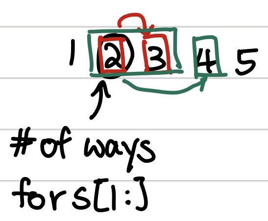

# Decode Ways

## Transitions

1. If `s[i] = '0'` , then invalid ways (0)
2. If `s[i] = '1'`, then we can choose to take `s[i]` as it is, or pair it with the next digit (no matter what, it will form a valid number)
3. If `s[i] = '2'`, then we can choose to take `s[i]` as it is, or pair it with the next digit as long as the next digit is from `'0'` to `'6'`
4. Any other digits have to be taken as it is

## Top-down

Modelling the transitions as-is gives us:

$$
dp(i) = \begin{cases}
0, s[i] = 0\\
1, i \geq |s|\\
dp(i+1), s[i] \not \in [1,2]\\
dp(i+1) + dp(i+2), s[i] = 1 \lor (s[i] = 2 \land s[i+1] < 6)
\end{cases}
$$

```python
def decode_ways(s):
    def ways(i):
        if i >= len(s): return 1
        if s[i] == '0': return 0
        ans = ways(i + 1)
        if i + 1 < len(s) and (s[i] == '1' or (s[i] == '2' and s[i + 1] <= '6')):
            ans += ways(i + 2)
        return ans
    return ways(0)
```

We can then memoize the value of each recursive call by index `i`.

## Bottom-up

To solve this problem using bottom-up, let's re-frame the problem. However, notice that we cannot use the prefix of the array. This is because if we were to use the prefix `s[:i+1]`, we would need to look-ahead to `s[i+1]`, which should not be available yet. So we can re-framing the problem using suffixes instead:

> Given $$[i, n)$$, can we find out how many ways there are to form $$s[i-1]$$?


**Trick:** when to use suffixes\
\
When re-framing the problem, it may not be intuitive if the prefix or suffix should be used. A good way to see if a suffix is needed is **if each state relies on looking ahead**. This makes prefixes untenable as the prefixes should not permit the look ahead.


<figure><figcaption></figcaption></figure>

Looking at the example above, if we have index `i`, then we can use the values computed from `i+1` onwards to figure out how many ways there are to form `s[i:].`

This gives us the recurrence relation:

$$
dp(i) = \begin{cases}
1, i = |s|\\
0, s[i] = 0\\
dp(i+1), s[i] \not\in [1, 2]\\
dp(i+1) + dp(i+2), s[i] = 1 \lor (s[i] = 2 \land s[i+1] < 6)
\end{cases}
$$

Notice that it looks very similar to the original recurrence as we are essentially doing the same operations.&#x20;

We can also apply the $$n$$ state caching optimization, where $$n = 2$$.

```python
def decode_ways(s):
    n = len(s)
    if n == 1: return 1
    s1, s2 = 1, 0 # s1 -> dp(i+1), s2 -> dp(i+2)
    for i in range(n - 1, -1, -1):
        si = 0 if s[i] == '0' else s1 # equivalent to collapsing the first 3 cases
        if i < n - 1 and (s[i] == '1' or (s[i] == '2' and s[i + 1] <= '6')): 
            si += s2
        s1, s2 = si, s1
    return s1
```

Note that the default values of `s1` and `s2` are both derived from the two base cases we have, with `s1 = 1` because `i = |s|` and `s2 = 0` because `i > |s|` (out of bounds so no ways to form it).
