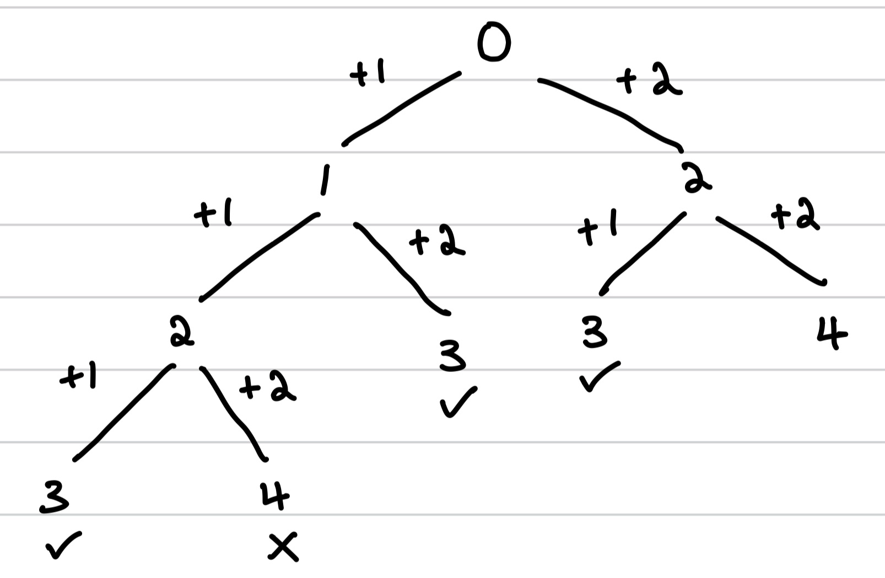

# Climbing Stairs

## State transitions

Observe that for every stair, you can make two decisions:

1. Climb one step
2. Climb two steps

## Recurrence tree

To model this as a tree, we can see the following:

<figure><figcaption></figcaption></figure>

Notice that if we exceed the `n`, we will not count that as a way to form `n`.&#x20;

Also notice that we are essentially repeating the computation of `2` twice, telling us that we can save some time by memoizing the result of `2` when it's first computed in the left sub-tree so the computation on the right sub-tree is reduced to an $$O(1)$$ lookup.

## Top-down

To solve this as a DP problem, we first model the decisions (or state transitions) and then implement memoization or tabulation.

The memoization code looks like this:

```python
def climb_stairs(n):
    memo = {}
    def climb(m):
        if m in memo: return memo[m]
        if m == n: return 1
        if m > n: return 0
        memo[m] = climb(m + 1) + climb(m + 2)
        return memo[m]
```

The recurrence relationship above looks like this:

$$
dp(m) = \begin{cases}
1, m == n\\
0, m > n \\
dp(m + 1) + dp(m + 2)
\end{cases}
$$

## Bottom-up

To implement it iteratively, we can focus on trying to think of building from base cases (i.e. thinking in reverse) where we start with asking

> How many ways can we form `m` given we know how many ways we have to solve everything till `m - 1` so far?

This way, we can instead model our recurrence relationship as such:

$$
dp(m) = \begin{cases}
1, m == 1\\
2, m == 2\\
dp(m-1) + dp(m - 2)
\end{cases}
$$

The reason why we can do so is because we can observe that given `m`, the ways to reach `m` is simply the ways it took to reach `m - 1` and the ways it took to reach `m - 2` combined.

Answering this, we can re-model the solution iteratively:

```python
def climb_stairs(n):
    if n == 1: return 1 # corner case
    stairs = [0] * (n + 1)
    stairs[1] = 1 # reaching stair 1 takes 1 way
    stairs[2] = 2 # reaching stair 2 takes 2 ways
    for i in range(3, n + 1):
        stairs[i] = stairs[i - 1] + stairs[i - 2]
    return stairs[n]
```

## Optimization

Notice that for every `i` we are at, we only ever reference the previous two states, i.e. `i - 1` and `i - 2`. As such, we don't need to use an array to store all of the past states. Instead, we can just use two variables to represent `i - 1` and `i - 2` respectively.


This is a very common optimization technique for DP problems where if you only rely on the previous `n` rows/columns and `n` is finite, then we can simply store using `n`, rather than storing all previous states that might not be used at all.


```python
def climb_stairs(n):
    if n == 1: return 1 # corner case
    s1, s2 = 1, 2
    for i in range(3, n + 1):
        s1, s2 = s2, s1 + s2
    return s2
```

## Conclusion

After more time spent inspecting this relationship, what you will observe is that this is effectively the Fibonacci Sequence. This is a common DP pattern where $$dp(i)$$is dependent only on the most recent $$n$$ states, so storing just $$n$$ variables is sufficient.
